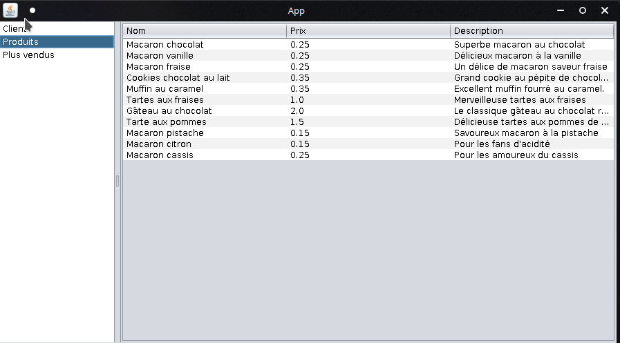

# Java App for the Project Two

[](https://search.maven.org/#search%7Cga%7C1%7Cg%3A%22com.atlassian.commonmark%22)

Made in **Java** with the framework **Swing** to create graphic interfaces

## Tasks to do

- [x] Multiple panels for the app to allow he user to navigate through it.
- [x] Do a listing of the products
- [x] Display dynamic column names
- [x] Add clients number of products bought
- [x] Add the most sold products order by descending
- [ ] **Deployment with the database for the execution**
- [ ] Add search bar for user input (?)

## Importing the project in Eclipse

To import the project in Eclipse, clone it somwhere on your pc, make sure to have the right database and user / password that correspond to your connection.

Make sure to have the jdbc driver library in the lib folder to be able to connect to the DB.

```Markdown
File > Import > Maven > Existing Maven project > Browse > Select the directory of the project
```

Click on the "Run" button to launch it.

Since it's a local DB, make sure to either import the database that is in the repo and change this line in the TabPane.java

```Java
Connection con = DriverManager.getConnection("jdbc:mysql://localhost/projet?serverTimezone=UTC", "root","root");
```

Change the username and password if needed to access your database.

## Screenshots of the "app"



## Credits

Alexandre TO

Christopher WILLIAMS

Laurine PILLET
